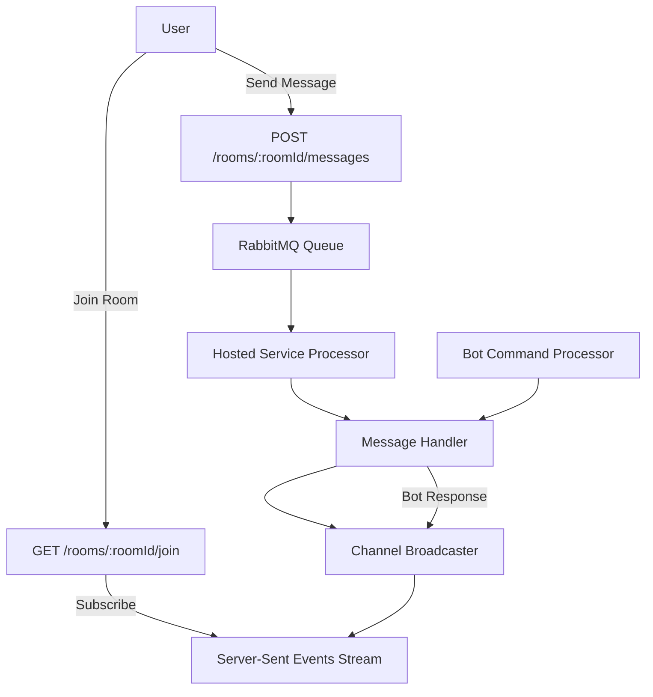

# Chat Room System with SSE, RabbitMQ, and Bot 🤖💬

## Overview
This project implements a **real-time chat room system** where users can communicate with a bot using **Server-Sent Events (SSE)**.  
The system leverages **RabbitMQ** and a **Hosted Service** to handle background message processing, ensuring scalability and non-blocking API requests.

---

## Features
- 📡 **Server-Sent Events (SSE):** Real-time message streaming to clients.
- 📨 **Message Queue (RabbitMQ):** Decouples message handling from API calls.
- ⚙️ **Hosted Service:** Background processing of queued messages.
- 🔔 **Channel Broadcaster:** Sends processed messages to all subscribers.
- 🤖 **Bot Integration:** Special commands trigger automated bot responses.

---

## API Endpoints

### 1. Join a Room
Open a persistent connection to listen for messages in a room.

```csharp
app.MapGet("/rooms/{roomId}/join", async (
    string roomId,
    HttpContext httpContext,
    IEventBroadcaster broadcaster,
    CancellationToken cancellationToken) =>
{
    httpContext.Response.Headers.Append("Content-Type", "text/event-stream");

    var reader = broadcaster.Subscribe();

    await foreach (var (msgRoomId, data) in reader.ReadAllAsync(cancellationToken))
    {
        if (msgRoomId != roomId) continue;

        await httpContext.Response.WriteAsync("event: messageReceived\n", cancellationToken);
        await httpContext.Response.WriteAsync("data: ", cancellationToken);
        await JsonSerializer.SerializeAsync(httpContext.Response.Body, data, cancellationToken: cancellationToken);
        await httpContext.Response.WriteAsync("\n\n", cancellationToken);
        await httpContext.Response.Body.FlushAsync(cancellationToken);
    }
})
.WithName("JoinRoom");
````

### 2. Send a Message

Publish a new message to the room. Messages are queued in RabbitMQ and processed asynchronously.

```csharp
app.MapPost("/rooms/{roomId}/messages", async (
    string roomId,
    SendMessageCommand command,
    SendMessageHandler handler,
    CancellationToken cancellationToken) =>
{
    var result = await handler.HandleAsync(
        command with { RoomId = roomId, UserType = Rooms.FromType.User },
        cancellationToken);

    return Results.Ok(result);
})
.WithName("SendMessage");
```

---

## Flow Summary

1. A **user creates a room** and joins it through `/join`.
2. A **Server-Sent Events (SSE)** connection keeps the client subscribed to real-time updates.
3. The **user sends a message** to the room via `/messages`.
4. The API publishes the message into **RabbitMQ**.
5. A **Hosted Service** consumes the queue and processes messages asynchronously.
6. The **handler pushes the result** to a **Channel**.
7. The **Channel broadcaster** notifies all subscribed SSE clients in that room.
8. If the message is a **command**, the **bot generates a response** which is sent back as a message of type `bot`.

---

## Architecture Diagram


---

## Demo Video 🎥

A short demo video is included in the repository:


If it does not play inline, click here:
[▶️ Watch the demo](docs/assets/demo.mp4)

---
